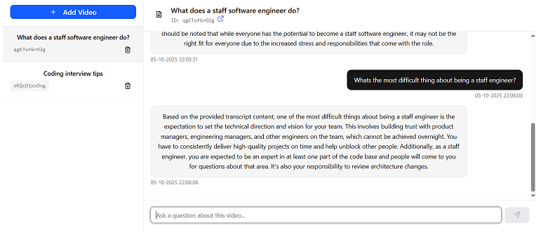

Askie is a Retrieval-Augmented Generation (RAG) app that lets users ask natural-language questions about youtube videos and receive context-aware answers.

## Features:

* Transcript ingestion & embedding storage in PostgreSQL

* Vector search with pgvector for retrieving semantically relevant transcript chunks

* A chat-style interface for Q&A and conversation history

* Transcript summarization

## Built with:

Frontend: React, TypeScript, TailwindCSS, Zod

Backend: Flask (Python), PostgreSQL + pgvector, LangChain, OpenAI API
